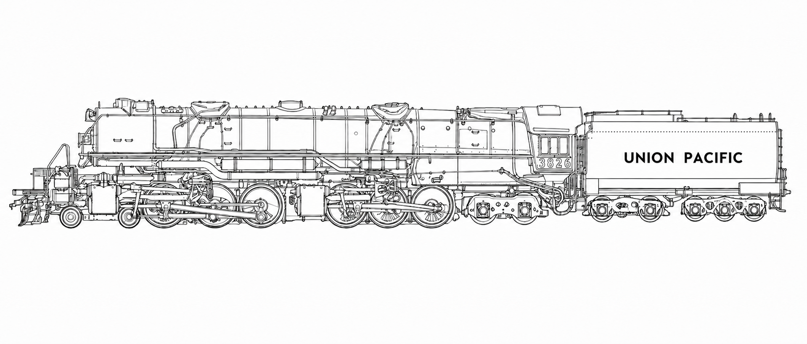

# MTOS

**Model Train Operating System**



MTOS is a lightweight, open-source platform for managing model-rail assets and
operating a model railway. It is intended to run on modest single-board
computers and provide a browser-based experience without requiring JMRI,
WiThrottle, or another heavyweight desktop application.

## Project intent

MTOS will provide one coherent platform for:

- asset inventory, acquisition, configuration, maintenance, and retirement;
- layout definition, including track, turnouts, signals, and trackside assets;
- command-station integration and safe train control;
- programming locomotives and accessories;
- operating sessions, routes, interlocking, and eventual automation;
- phone, tablet, and desktop access through a lightweight web interface.

MTOS is not tied to a railroad, scale, command station, control protocol, or
host computer. Hardware and protocol integrations are adapters around the MTOS
domain rather than assumptions embedded in it.

## Status

The asset-management application runs on Python, Flask and SQLite with an
iPhone-first browser interface. Add, search and update rolling or stationary
assets; manage lifecycle, consists, and photos. Layout operation will follow.

## Run the roster

```bash
python3 -m venv .venv
. .venv/bin/activate
python3 -m pip install -e '.[dev]'
tools/asset_manager start
```

Open `http://127.0.0.1:5301`. Use `tools/asset_manager restart`, `stop`, or `status` to
manage the service. For a phone on a trusted LAN, start with `--host 0.0.0.0` and
open the host's IP address on port 5301. This release has no account authentication.

The database lives in `data/db/`; photos live in `data/media/`. Both are excluded
from Git. Backups are manually invoked to an existing mounted destination:

```bash
tools/mtos_backup --remote ~/gdrive/backup/mtos/data --backup
tools/mtos_backup --remote ~/gdrive/backup/mtos/data --restore
python3 tools/import_image.py --source ~/Pictures/train-photos/
```

See [the roster guide](docs/operations/roster.md) for migration, configuration,
backup verification, restore, and JSON endpoints.

The service is named `asset_manager` (port 5301). The future DCC/electronics
service is `asset_control` (port 5302); its launcher reserves the interface and
reports that control functionality is not implemented yet.

Current design material is under [`docs/`](docs/README.md).

## License and name

Source code is licensed under the Apache License 2.0. See [`LICENSE`](LICENSE).

MTOS, Model Train Operating System, and future MTOS logos identify the official
project and are not licensed as product names for modified distributions. See
[`TRADEMARKS.md`](TRADEMARKS.md).
