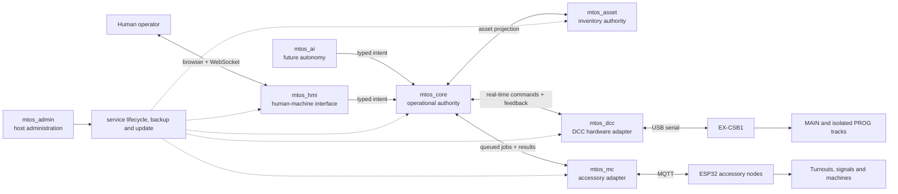
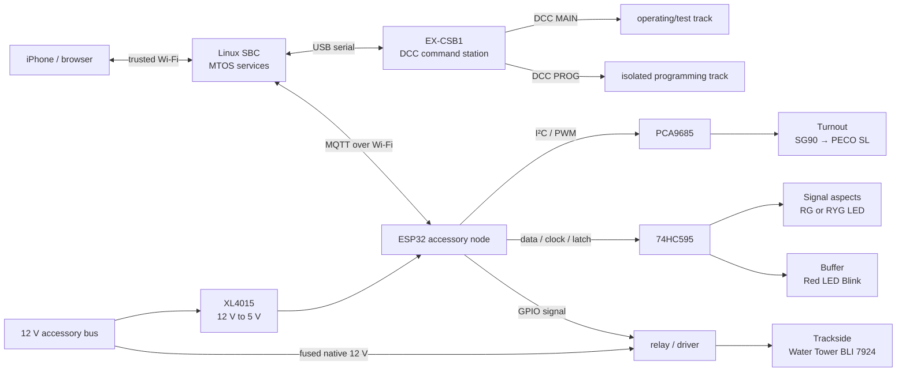
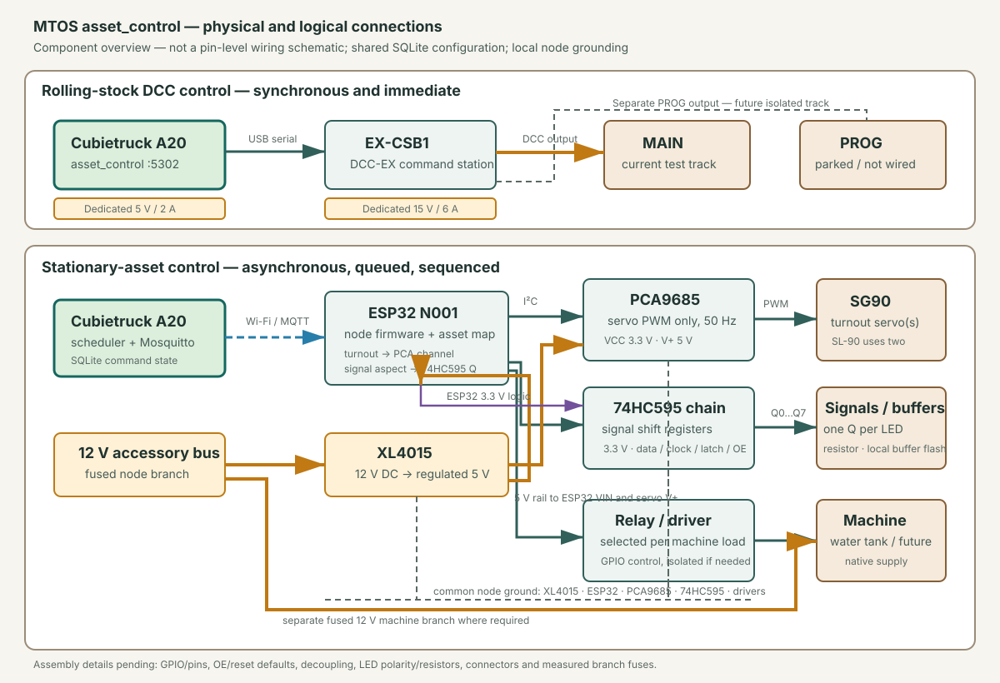

# MTOS

**Model Train Operating System**

MTOS is a lightweight, open-source platform for managing model-rail assets and
operating a model railway. It is intended to run on a modest single-board
computer and provide a phone-first browser experience without requiring JMRI,
WiThrottle, or another heavyweight desktop application.

## Project intent

MTOS provides one coherent platform for:

- asset inventory, acquisition, configuration, maintenance, and retirement;
- layout definition, including track, turnouts, signals, and trackside assets;
- command-station integration and safe locomotive control;
- decoder and CV programming;
- operating sessions, routes, interlocking, and eventual automation; and
- phone, tablet, and desktop access through a lightweight web interface.

MTOS is not tied to a railroad, scale, command station, control protocol, or
host computer. Hardware and protocol integrations are adapters around the MTOS
domain rather than assumptions embedded in it.

## High-level architecture

| Functional block | Responsibility |
| --- | --- |
| `mtos_admin` | Starts and stops the application stack, reports service health, backs up/restores `data/`, and updates a clean deployed checkout. |
| `mtos_asset` | Owns asset identity, roster, lifecycle, configuration, relationships and media. |
| `mtos_hmi` | Provides the mobile-first operator interface and real-time command/status channel. It owns no hardware. |
| `mtos_core` | Central operational authority: validates intent, leases assets, applies safety policy, sequences work and records transactional state. |
| `mtos_dcc` | Sole owner of the EX-CSB1 USB serial connection for DCC MAIN operation and PROG-track programming. |
| `mtos_mc` | Hardware abstraction and serialized scheduler for ESP32-controlled turnouts, signals and trackside machines. |
| `mtos_ai` | Future optional intent producer. It may request operations but never bypasses Core or controls hardware directly. |

Asset and HMI are available on the trusted layout LAN. Core, DCC and MC remain
loopback-only. Each state-owning service has its own SQLite database; services
communicate through versioned interfaces rather than cross-database writes.

## Devices and connections

Select the circuit diagram once to open the full-size vector graphic. It has no
embedded navigation or magnification controls.

- **Control host:** a headless Linux SBC runs the deterministic services and
  owns the operational databases. The current installation uses a Cubietruck.
- **DCC path:** EX-CSB1 connects directly by USB serial for immediate locomotive
  commands and decoder feedback. MAIN and PROG outputs feed isolated tracks.
- **Accessory node:** one node combines an ESP32, one XL4015, one PCA9685 and a
  74HC595 chain. Node configuration maps asset IDs to physical channels.
- **Turnout (SG90 → PECO SL):** PCA9685 provides servo PWM; SG90 movement is
  serialized so no two servos operate simultaneously. The regulated 5 V output
  from XL4015 supplies servo `+Vcc` directly rather than through the ESP32.
- **Signal aspects (RG or RYG LED):** mutually exclusive LED aspects are shifted
  through 74HC595 outputs with an individual current-limiting resistor per LED.
- **Buffer (Red LED Blink):** a 74HC595 output drives each resistor-protected red
  LED; node firmware produces the blink pattern.
- **Trackside (Water Tower BLI 7924):** an ESP32 control signal drives the relay
  interface, whose separately fused 12 V input and switched output supply or
  trigger the water-tower circuit as established during hardware commissioning.
- **Power:** the layout distributes 12 V. XL4015 supplies the regulated 5 V node
  rail; equipment that needs native 12 V uses a separately fused branch and an
  electrically appropriate relay or driver.

The diagram is a system connection schematic, not a substitute for a verified
pin-level wiring plan, fusing, measured load budget or electronics commissioning.

## Operational overview

The operator opens HMI from a phone, selects an eligible active asset and sends
an intent. Core validates asset configuration and operational ownership before
dispatching it. DCC commands travel synchronously through the exclusive EX-CSB1
adapter; device reports return immediately to the HMI. Accessory commands become
durable MC jobs and are delivered asynchronously over MQTT. Servo work is
globally serialized, while signal aspects and bounded machine actions follow
their node configuration. Track power is never enabled merely because the host
or application has started.

Asset records remain the authoritative description of what equipment exists and
how it is configured. Core owns operational transactions. DCC and MC provide
hardware evidence but do not become alternate business authorities. Future AI
operation follows exactly the same Core safety boundary as a human operator.

## Why MTOS

Compared with a closed command-station handset or a collection of unrelated
desktop utilities, MTOS is designed to provide:

- one searchable inventory and operating environment instead of separate roster
  and control silos;
- a responsive phone-first interface with no mandatory proprietary throttle;
- lightweight SBC deployment without a continuously running Java desktop stack;
- explicit hardware-abstraction boundaries, allowing command stations and
  accessory electronics to evolve independently;
- direct USB control for latency-sensitive DCC and resilient MQTT control for
  distributed accessories;
- local SQLite data ownership, offline operation and operator-controlled backup;
- observable acknowledgements, device feedback and durable operational history;
  and
- a controlled path to routes, interlocking and autonomy without granting AI
  direct hardware authority.

MTOS does not remove the need for electrically safe wiring, command-station
protection, layout operating rules or supervised hardware commissioning.

## Status

Asset management and the Phase 1 DCC MAIN path are implemented with Python,
Flask, React, Socket.IO and SQLite. Asset, HMI, Core and DCC are integrated.
The MC host path and ESP32 firmware source are implemented against deterministic
fakes; physical ESP32, PCA9685, 74HC595 and layout-accessory commissioning is
pending.

The decoder-address programming workflow has a coordinated backend and UI design,
but physical EX-CSB1/decoder PROG commissioning remains incomplete. General CV
programming, occupancy detection, routes, interlocking, autonomous operation,
history pruning and full layout commissioning remain future work. Accessory
controls stay unavailable until MQTT and the selected physical node are ready.

## Important documentation

- [Documentation index](docs/README.md)
- [Product scope and boundaries](docs/decisions/ADR-001-product-scope.md)
- [Service and real-time control architecture](docs/architecture/control-service-architecture.md)
- [Asset inventory model](docs/decisions/ADR-008-asset-inventory-model.md)
- [Stationary assets, control network and power](docs/decisions/ADR-007-stationary-assets-control-network-and-power.md)
- [CV programming plan](docs/architecture/cv-programming-plan.md)
- [Roster and asset-data operations](docs/operations/roster.md)
- [Integrated startup and shutdown](docs/operations/service-startup.md)
- [Provision a fresh SBC](docs/operations/sbc-provisioning.md)
- [Deploy and operate the Admin service](docs/operations/admin.md)
- [Cubietruck installation record](docs/operations/cubietruck-installation-context.md)
- [Current project checkpoint](docs/mtos-context.md)

## License, project name and third-party names

Source code is licensed under the Apache License 2.0. See [LICENSE](LICENSE).

MTOS, Model Train Operating System, and the MTOS logos identify the official
project and are not licensed as product names for modified distributions. See
[TRADEMARKS.md](TRADEMARKS.md).

Cubietruck, EX-CSB1, DCC-EX, ESP32, PCA9685, XL4015, SG90, 74HC595 and other
third-party product or project names belong to their respective owners. They are
used only to identify compatible equipment. Their mention does not imply
affiliation, sponsorship or endorsement.
