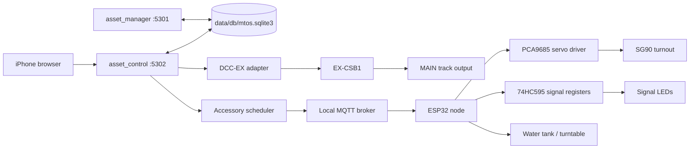
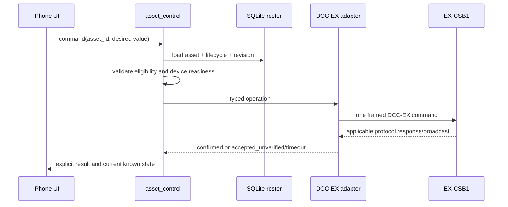
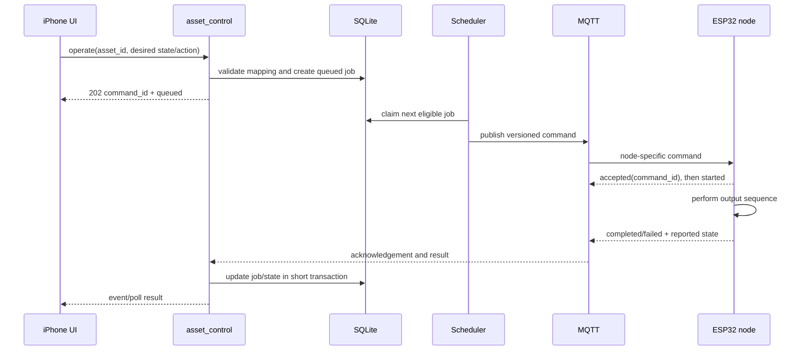

# asset_control pre-design

> **Historical design baseline.** ADR-009 supersedes this document's single
> `asset_control` process, shared-database access, command-producer placement and
> polling assumptions. Retain it for device requirements and staged scope only;
> the target services and authority are defined by the
> [control-service architecture](control-service-architecture.md).
>
> Updated review: the [implementation contract](asset-control-implementation-contract.md)
> dated 2026-09-17 governs refined execution, provisioning, sequencing and recovery
> details below. Chemical-plant control is deferred; buffer lights are included.

- **Date:** 2026-09-14
- **Status:** Historical/superseded topology; retained requirements baseline
- **Service:** `asset_control`, Flask, `0.0.0.0:5302`
- **Data authority:** the same SQLite database used by `asset_manager`

## Objective

`asset_control` provides direct, low-level operation of physical model-railroad
assets already described by the MTOS roster. It has two control points:

1. rolling-stock DCC control through one EX-CSB1 command station over USB serial;
2. stationary-asset control through ESP32 accessory nodes over MQTT/Wi-Fi.

The first increment operates a named asset directly. It does not calculate routes,
reserve blocks, enforce interlocking, detect occupancy, or implement autonomous
operation. A future request such as “clear yard_south_4 to main_south_2 for UP 28”
will compose these low-level operations, but is outside this design.

## Confirmed product decisions

- `asset_manager` owns asset identity, lifecycle, installed control configuration,
  components, relations, and media.
- `asset_control` owns live connection state, command execution, desired state,
  reported state, faults, and bounded operational history.
- Both services use `data/db/mtos.sqlite3`; there is no second roster or JSON
  inventory. SQLite transactions protect database changes, but cannot make a
  physical hardware action atomic.
- `asset_control` binds `0.0.0.0:5302` and uses
  `tools/asset_control (start|stop|restart|status)`.
- The Cubietruck A20 is the only command producer. Axon is reserved for later SLM
  inference and must not send independent hardware commands.
- The locomotive/track-power path is synchronous from the application's point of
  view: validate, send immediately, wait for the applicable device response or a
  bounded timeout, then return a result. “Synchronous” does not mean that every
  DCC command has physical locomotive feedback.
- The ESP32 path is asynchronous: validate and persist intent, enqueue it, publish
  over MQTT, receive acknowledgement, then receive completion/reporting. One
  central scheduler sequences actuator jobs; nodes do not share a distributed
  lock or MQTT shared-subscription work queue.
- Turnout servo movement is serialized to control SG90 peak load. Signal changes
  are break-before-make so mutually exclusive aspects cannot be on together.
- Version 1 signals use raw PCB/SMD LEDs controlled as defined by asset components.
- MAIN/PROG switching and CV programming are parked. There is currently one test
  track connected to CSB1 MAIN. The second isolated track and connectors are not
  available yet. Ordinary MAIN operation must not depend on resolving this now.
- No raw DCC-EX serial command or arbitrary MQTT topic/payload is exposed through
  the public API or UI.

## System boundary

The browser edge is revised by
[the real-time control architecture](control-service-architecture.md): commands
and state use Socket.IO/WebSocket rather than one-second polling. The serial and
MQTT paths fail independently. Loss of Wi-Fi or MQTT may make
stationary assets unavailable, but must not interrupt the CSB1 transport. Loss of
CSB1 must not stop the accessory scheduler. The UI presents both control points
without pretending their acknowledgement semantics are identical.

The repository-native vector schematic is
[asset-control-connections.svg](../images/asset-control-connections.svg).

## Control vocabulary

### Command station

- connection: `disconnected | connecting | ready | error`
- output power: `unknown | off | on | fault`
- throttle direction: `forward | reverse`
- throttle speed: integer `0..126`
- function: integer `0..68`, state `off | on`
- result: `confirmed | accepted_unverified | timeout | rejected | uncertain`

`ready` requires a successful DCC-EX exchange and identity response, not merely an
open serial port. Track-power and throttle responses are interpreted according to
what the command station actually reports. A serial write alone is not physical
proof that a locomotive moved, a lamp illuminated, or a sound played.

### Stationary assets

- turnout state: `straight | diverging`; `normal | reverse` are not used
- two-aspect signal state: `stop | go`
- three-aspect signal state: `stop | slow | go`
- electrical fallback for a signal: `dark`; it is not a railroad aspect
- machine action: a validated action declared by the specific machine asset, such
  as `operate` for a water tank; turntable actions require a separate concrete
  action set before implementation
- job state: `queued | dispatched | accepted | started | completed | rejected | failed | expired |
  cancelled | uncertain`
- node availability: `unknown | online | stale | offline | error`

## Data ownership and shared-database use

The roster remains the source for:

- `asset.id`, `family`, and `type`;
- lifecycle eligibility and location;
- DCC address and decoder configuration;
- stationary asset `control.node_id`;
- component bus/channel mapping and calibrated values;
- relations required for operation.

`asset_control` must query those normalized tables through shared MTOS repository
code. It must not copy them into a control-specific master table. A command records
the asset ID and the configuration revision used for validation so a queued command
cannot silently execute against changed wiring.

Later migrations may add operational tables in the same database:

- `control_device`: configured adapter identity and connection settings;
- `control_job`: durable accessory command intent and outcome;
- `control_event`: bounded, structured hardware/transport events;
- `control_state`: last desired/reported state by asset or output.

Those names and columns are proposals, not approved schema. Runtime locks, serial
objects, MQTT connections, queue objects, and freshness timers remain in memory.
Do not persist an unbounded serial or MQTT transcript in SQLite.

SQLite will coordinate the two services in WAL mode with short transactions and
the existing busy-timeout conventions. WAL must be explicitly enabled and verified
during implementation; current roster code does not enable it. No transaction remains open while
waiting for serial, MQTT, or physical motion.

## Operating eligibility

Every command begins with fresh roster validation.

### Locomotive

Initial MAIN eligibility requires:

- family `loco` or a self-propelled MOW type explicitly supported later;
- possession `received`;
- status `active`;
- a valid DCC address in `control`;
- required asset relations satisfied and co-located;
- command-station connection `ready` and applicable output power known.

The UI selects by immutable `asset_id` and displays reporting mark/road number. The
adapter resolves the current address at execution time. A numeric decoder-address
override is a diagnostic capability and should not be the normal operator path.

### Stationary asset

Initial eligibility requires:

- family `turnout`, `signal`, or `machine`;
- possession `received` and status `active`;
- a valid `control.node_id` whose node is active;
- required component connections and values for the requested operation;
- fresh online node status, verified boot/session identity and installed configuration;
- the command references the current asset/configuration revision.

An unavailable node does not make the asset record invalid; it makes operation
temporarily unavailable.

## Execution model

### DCC path: immediate and bounded

One transport owner serializes writes and request/response matching. Emergency
stop and locomotive stop pre-empt or cancel stale throttle work. Disconnect clears
pending work; reconnect never restores power, speed, direction, functions, or old
commands automatically. All hardware state becomes unknown until rediscovered.

### ESP32 path: durable queue and serialized actuation

The scheduler owns global servo sequencing. It dispatches one servo movement,
waits for completion or timeout, then dispatches the next. Non-servo work may only
run concurrently when an explicit power/concurrency class permits it. Version 1
can conservatively serialize all actuator/machine jobs while allowing low-current
signal changes if measurements support that decision.

Commands publish to the node that physically owns the mapped asset. MQTT shared
subscriptions are not used: another node cannot operate wiring it does not own.
QoS 1 means duplicates are possible, so node firmware must reject/replay safely by
  `command_id` within its boot session and return the prior outcome for a duplicate.

## Low-level operations in the first implementation

| Asset/control point | Request | Required mapping | Completion meaning |
|---|---|---|---|
| CSB1 connection | connect/disconnect | configured serial selection | verified DCC-EX identity / port closed |
| Track power | off/on | CSB1 output | command-station reported power where available |
| Locomotive | speed + direction | asset ID -> DCC address | CSB1 accepted/reported throttle state; not proof of motion |
| Locomotive | function off/on | asset ID -> address, F0..F68 | CSB1 accepted/reported function state where available |
| Locomotive | stop | asset ID -> DCC address | speed-zero command sent with priority |
| Railroad | emergency stop | CSB1 | emergency command sent; state remains conservative |
| Turnout | straight/diverging | node-resident asset map, servo channel, calibrated positions | node finished timed PWM movement and disabled PWM |
| Signal | stop/slow/go | node and one LED channel per aspect | node completed break-before-make output sequence |
| Water tank | operate | node and declared machine components | node completed the defined action sequence |
| Turntable | deferred action set | node and hardware-specific components | unknown until mechanism/interface is selected |

CV programming, address changes, programming-on-main, JOIN, output-role switching,
and running from the PROG-connected bench are deliberately absent from this table.

## UI direction

The Flask application serves an iPhone-first interface without adding a separate
Node/React production runtime. The first screen has:

- a persistent emergency-stop control when CSB1 is ready;
- independent CSB1 and accessory-network readiness summaries;
- locomotive, turnout, signal, and machine selectors sourced from SQLite;
- controls generated only for operations valid for the selected asset;
- clear distinction between `confirmed`, `accepted_unverified`, `queued`,
  `accepted`, `started`, `completed`, `failed`, and `unknown`;
- disabled controls with a visible reason when asset or device is ineligible;
- minimum 44 px touch targets and the existing MTOS visual language.

The UI must not display a queued accessory command as completed or a serial write
as physical feedback. ADR-009 supersedes the original polling proposal:
Socket.IO/WebSocket is the normal command/event path, with snapshots after a
reconnect or sequence gap. HTTP polling is diagnostic compatibility only.

## Safety and failure rules

- Startup and reconnect are de-energized/conservative: no automatic power-on,
  throttle restoration, function restoration, actuator replay, or retained MQTT
  command replay.
- A connection error makes applicable reported state `unknown`, not `off`.
- Emergency stop cancels pending throttle commands before transmission.
- Expired accessory jobs are not dispatched. A dispatched timeout becomes
  `uncertain`, because the physical action may have occurred.
- A changed asset revision invalidates an undispatched job.
- A node boot/session change invalidates old acknowledgements and commands.
- Signal transition is break-before-make; failure should prefer `dark` rather than
  risk conflicting aspects.
- A turnout without position feedback reports command completion, not confirmed
  physical point position.
- Physical emergency power-off remains accessible. Software cannot guarantee
  power removal when USB, Wi-Fi, the broker, or the SBC has failed.

## Explicitly parked work

- MAIN/PROG output-role discovery and guarded switching;
- service-mode CV read/write and verified decoder-address changes;
- programming-on-main and JOIN;
- second isolated test-track commissioning;
- routes, blocks, occupancy, interlocking, dispatching, and route clearing;
- feedback sensors for turnout position, signal illumination, or train identity;
- Axon/SLM command production and autonomous operation;
- arbitrary machine sequencing before each machine's electrical interface exists.

Parking these items prevents the current one-track limitation from distorting the
ordinary MAIN and accessory-control foundation.

## Known versus unknown at this checkpoint

### Known

- EX-CSB1 ordinary MAIN operation works in the predecessor application.
- The current single test track is physically connected to the CSB1 MAIN output.
- The predecessor uses 115200-baud serial DCC-EX frames and already encodes power,
  throttle, F0–F68, emergency-stop, and service CV commands.
- The predecessor's automated CSB1 suite passed 32 tests during the earlier review;
  its programming tests mock replies and are not hardware evidence.
- MTOS's live roster and configuration authority is the existing SQLite database.
- Stationary control uses ESP32 nodes over local MQTT/Wi-Fi, one PCA9685 per node
  for SG90 servos only, one XL4015 per node for local 12 V-to-5 V conversion, and
  cascaded 74HC595 registers for raw signal LED aspects. Turnout and signal
  asset/channel maps are stored by the owning ESP32 with a configuration revision.
- The Cubietruck owns serial control, MQTT production, durable scheduling, and
  operational reconciliation. Axon does not produce hardware commands.
- Turnout servo commands are centrally sequenced one at a time; MQTT uses QoS 1,
  node-specific topics, command expiry, boot identity, configuration revision,
  and duplicate-safe command IDs.

### Unknown or unresolved

- Current live CSB1 firmware, reported capabilities, A/B output roles, and exact
  response forms beyond those observed in predecessor fixtures.
- ESP32 firmware implementation, provisioning, credentials, configuration
  distribution, and tested MQTT message handling; predecessor ESP32 sources are
  placeholders only.
- Exact signal driver topology and channel allocation for the constructed nodes.
- Water-tank dry-contact/interface timing and measured current.
- Turntable motor driver, homing, position model, feedback, and actions.
- Socket.IO/WebSocket supplies accessory job updates; one-second HTTP polling is
  not the normal operational path.
- ADR-009 defines Version 1 operational history and cleanup limits.
- MAIN/PROG switching, CV programming, and address-change recovery; all are parked.

Unknowns that affect a concrete device operation must be resolved before that
operation is enabled. They do not block the DCC MAIN transport foundation, fake
interfaces, shared-database integration, or scheduler framework.

## Definition of the next coding checkpoint

The next checkpoint may implement device adapters, operational persistence, Flask
API/UI, service startup, tests, accepted ADRs, and an SVG internal-connection
schematic. It must still be split into safe increments:

1. schema and fake-device contracts;
2. DCC-EX transport/readiness and MAIN low-level controls;
3. MQTT node registry, durable queue, acknowledgement and sequencing;
4. turnout and signal operations;
5. water-tank operation after its exact node action is defined;
6. mobile UI and combined status;
7. automated verification, then separately authorized hardware commissioning.

No physical command should be issued merely by running the automated test suite.
