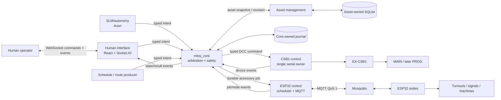
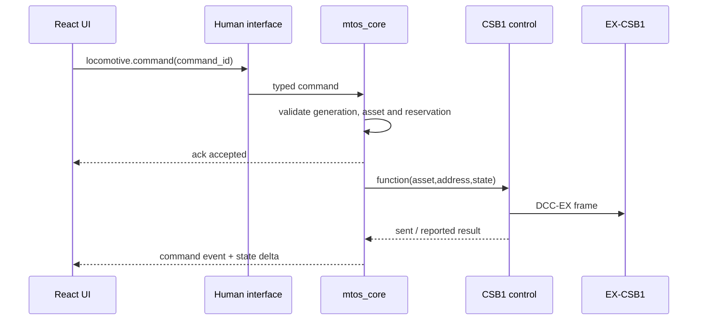

# MTOS control-service architecture

Date: 2026-09-18  
Status: detailed companion to accepted
[ADR-009](../decisions/ADR-009-service-decomposition-and-control-architecture.md);
Asset, DCC, Core, HMI and the hardware-free MC path are implemented; CV/PROG,
physical commissioning, route/interlocking and AI remain later work

## Decision summary

MTOS separates command producers, deterministic operational policy and physical
device adapters. `mtos_core` is the central nervous system. `mtos_dcc` and
`mtos_mc` are hardware-abstraction services, not alternate command authorities.

1. **`mtos_asset`** owns inventory master data, lifecycle,
   configuration and media.
2. **`mtos_hmi`** serves React and a Socket.IO connection for live
   commands, acknowledgements and state events.
3. **`mtos_core`** is the deterministic operational core. It resolves
   asset IDs, validates eligibility, arbitrates producers, reserves resources,
   enforces safety/interlocking and dispatches typed device commands.
4. **`mtos_dcc`** is the single owner of the EX-CSB1 serial connection
   and DCC-EX protocol state.
5. **`mtos_mc`** owns the accessory scheduler and MQTT projection for
   nodes, turnouts, signals and machines.
6. **`mtos_ai`** is an optional intent producer for SLM-assisted/autonomous
   operation; it has no direct hardware authority.

SLM/autonomous functions bypass `mtos_hmi`, but never bypass `mtos_core` or
address hardware abstractions directly.

## Service endpoints and exposure

| Service | Default endpoint | Exposure |
|---|---|---|
| `mtos_asset` | `0.0.0.0:5301` | trusted layout LAN |
| `mtos_hmi` | `0.0.0.0:5302` | trusted layout LAN |
| `mtos_core` | `127.0.0.1:5303` | local services only |
| `mtos_dcc` | `127.0.0.1:5304` | local Core only |
| `mtos_mc` | `127.0.0.1:5305` | local Core only |
| `mtos_ai` | `127.0.0.1:5306` when co-hosted | local intent producer |
| Mosquitto | `127.0.0.1:1883` plus controlled node-facing listener | ESP32 ACLs |

These defaults prevent browsers and arbitrary LAN clients from reaching hardware
services. If `mtos_ai` later runs on a separate Axon, do not change every Core
interface to `0.0.0.0`. Use an authenticated, allowlisted AI ingress or a secure
tunnel to the loopback Core endpoint.

## Component view



## Deployment view

Run each accepted boundary as a supervised service. Keep all services in the
same monorepo and share only versioned protocol/domain packages—not mutable
runtime state or unrestricted database connections.

`mtos_dcc` owns one reader thread, serial object and bounded command queue.
`mtos_mc` owns its scheduler and MQTT client. Their faults and restarts are
independent. `mtos_core` survives adapter unavailability, marks the relevant
capabilities unavailable and continues coordinating the rest of the system.

The optional `mtos_ai` submits high-level intents. Its loss or restart must not
stop manual control or alter established safe state.

Resource budgets, platform qualification, asset leases/fencing, Core watchdog
behavior, emergency bypass, durable MC recovery and queue/retention limits are
normative in ADR-009. This companion document does not redefine them.

## Browser real-time protocol

Use Socket.IO over WebSocket between React and the human interface. It provides
event acknowledgements and reconnection behavior with long-polling fallback. The
browser never accesses serial or MQTT directly.

On connection the server sends a full snapshot:

```json
{
  "event": "control.snapshot",
  "control_session_id": "uuid",
  "generation": "uuid",
  "event_seq": 1042,
  "device": {},
  "locomotives": {},
  "reservations": {}
}
```

Every later event has the same session and increasing `event_seq`. A sequence
gap, reconnect or changed session causes full resynchronization.

Commands use a typed, idempotent envelope:

```json
{
  "command_id": "uuid",
  "client_id": "uuid",
  "client_seq": 27,
  "generation": "uuid",
  "asset_id": "L046",
  "operation": "function",
  "payload": {"number": 1, "active": true}
}
```

The Socket.IO acknowledgement only means application acceptance or rejection:

```json
{"accepted": true, "command_id": "uuid", "state": "accepted"}
```

Transmission and result are separate events:

- `command.accepted`, `command.sent`, `command.completed`
- `command.failed`, `command.uncertain`
- `control.state_changed`, `device.connection_changed`
- `device.power_changed`, `locomotive.state_changed`

The acknowledgement returns quickly; serial work does not occupy a web request.
DCC-EX reader events are pushed immediately. Normal operation has no one-second
polling. HTTP health remains for supervision; HTTP snapshots and commands may
remain diagnostic compatibility interfaces.

Generation, sequence, command ID and reservation checks remain mandatory.
WebSocket delivery must not make acknowledgement look like physical confirmation.

## CSB1 control service

Responsibilities:

- discover and verify the selected USB command station;
- exclusively own serial open/close, framing, writes and continuous reads;
- maintain observed connection, output, power, throttle and function reports;
- execute typed power, throttle, function, stop and later programming commands;
- publish device events to the Core event stream;
- preserve an independent emergency-stop path;
- discard old-session work and never restore power or motion after reconnect.



## ESP32 control service and MQTT

MQTT is the correct control-host-to-ESP32 boundary: lightweight, asynchronous and
tolerant of intermittent Wi-Fi. Browsers do not publish MQTT.

- Mosquitto runs locally on the control host.
- Commands use node-specific topics, QoS 1 and non-retained payloads.
- Nodes emit accepted, started, completed or failed events with command,
  producer-session, boot and configuration-revision identities.
- Readiness needs fresh heartbeat plus session/configuration validation; a
  retained online message alone is insufficient.
- The service owns the durable global servo queue and sequences movement.
- Signal transitions and buffer flashing remain node-local output behavior.
- MQTT PUBACK proves broker receipt, not actuator completion.

## Core service

This is the central safety boundary, not a UI facade or generic hardware proxy:

- map immutable asset ID to current control configuration;
- check possession, status, dependencies, location and readiness;
- reject address/channel conflicts;
- reserve locomotives, routes and actuators;
- arbitrate human, scheduled and autonomous producers;
- journal commands and retain uncertain outcomes;
- enforce generation/session/idempotency rules;
- later enforce block occupancy, route locks, turnout alignment and signals;
- dispatch only typed operations supported by an adapter.

An SLM may propose “clear a route for UP 28.” Deterministic code resolves the
route, proves locks/occupancy, selects commands and rejects unsafe or ambiguous
intent. An SLM cannot submit raw DCC-EX, MQTT topics, servo channels or LED bits.

## Producer priority and safety

Suggested priority:

1. physical power removal and system emergency stop;
2. human emergency/stop;
3. deterministic safety/interlocking action;
4. accepted human operation;
5. accepted autonomous/scheduled operation.

All producers still pass the same eligibility and interlocking rules. Manual
takeover explicitly cancels or supersedes pending autonomous work. WebSocket loss
disconnects a display; it does not implicitly stop or restore a train.

## Advantages

- Immediate UI acknowledgement and pushed CSB1 state remove polling latency.
- Hardware ownership remains single and testable.
- Human and AI control share one safe command contract.
- MQTT stays isolated to constrained accessory devices.
- CSB1 and ESP32 failures and restarts remain independent.
- Core policy evolves without embedding device protocols or UI assumptions.
- Each service can be tested, supervised and upgraded against a versioned contract.

## Costs and constraints

- Waitress does not provide the required WebSocket runtime. Use a supported
  Flask-SocketIO/Gunicorn/simple-websocket or ASGI Socket.IO deployment.
- Reconnect, sequence gaps, duplicates and stale sessions need explicit tests.
- Acknowledgement, serial transmission, device report and physical effect remain
  distinct facts.
- Event history is bounded operational state, not unlimited telemetry.
- Multiple processes require health checks, startup ordering, version compatibility,
  structured logs and explicit recovery; systemd supervision is part of the design.

## Implementation sequence

1. Establish shared versioned command/event schemas and service health contracts.
2. Extract existing inventory/API ownership into the `mtos_asset` executable.
3. Extract serial ownership into `mtos_dcc`, retaining fake-transport tests.
4. Implement `mtos_core` command arbitration and its DCC service client.
5. Move the React bundle into `mtos_hmi`, replace polling with typed Socket.IO
   snapshot/events, and retain HTTP diagnostic compatibility.
6. Use a supported WebSocket-capable single-worker runtime for `mtos_hmi`;
   do not expose internal services to the LAN.
7. Test reconnect, duplicate commands, event gaps, emergency preemption and
   disconnect at every stage with fake serial.
8. Commission CSB1 MAIN under supervision.
9. Implement `mtos_mc` with ADR-006 session envelopes and a Mosquitto adapter.
   The host service, fake transport, Core/HMI route and ESP32 firmware are now
   implemented; live broker and electronics commissioning remain pending.
10. Add autonomous producers only after occupancy, route reservation and
   interlocking exist.

## Current implementation choices and remaining work

- HMI currently uses Flask-SocketIO threading with `simple-websocket` and the
  Werkzeug runner. A production supervisor/server choice still requires
  reconnect and SBC-load measurement; ASGI remains an alternative, not the
  implemented stack.
- Authentication between a remote AI host and the control host.
- Internal RPC currently uses loopback HTTP/JSON with a shared internal token.
  Version negotiation and stronger production authentication remain work within
  ADR-009's boundaries.
