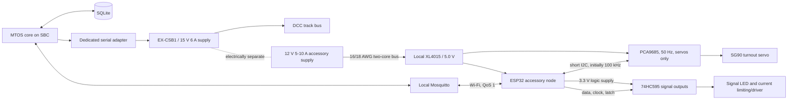

# Layout automation architecture

This document preserves the concrete system design from the four original
layout-automation ADRs while separating accepted architecture from prototype
code and unresolved contracts.

> **Canonical decision:** ADR-007 supersedes the earlier accessory ADRs. Where
> this historical architecture guide differs from ADR-007, ADR-007 governs.
> The [implementation contract](asset-control-implementation-contract.md) supplies
> the 2026-09-17 review amendments and current v1 scope.
> ADR-009 subsequently supersedes this guide's software-process topology and
> shared-persistence implication. Its physical ESP32/PCA9685/74HC595/XL4015
> design remains applicable; `mtos_core`, `mtos_dcc` and `mtos_mc` now have
> separate ownership and persistence contracts.

## Physical and software topology



The MQTT accessory path is deliberately outside the critical locomotive and
track-power path. A Wi-Fi or broker failure can make accessories unavailable,
but must not interrupt the EX-CSB1 serial connection.

## State authority and identifiers

SQLite is authoritative for durable asset identity, node/accessory
configuration, calibration, and operational records that MTOS promises to
retain. An accessory has a stable logical ID. Its node, PCA9685 address, and
channel are replaceable deployment mappings rather than its identity.

Operational state is separated into:

- **desired state**: the validated state MTOS intends;
- **acknowledged state**: the node accepted a particular command;
- **reported state**: the node reports it has completed the output action;
- **observed physical state**: known only when feedback hardware exists; and
- **availability**: node connectivity and health.

Without position or aspect feedback, reported state is not proof of mechanical
turnout position or visible signal aspect. Retained MQTT data is a transport
convenience, not a substitute for this model.

## Cluster profiles

An accessory node is the local controller and power assembly: one ESP32 linked
to the SBC's MQTT broker over Wi-Fi; one PCA9685 servo board on short I2C;
cascaded 74HC595 signal-output registers; a protected 12 V bus connection; one
local XL4015 12 V-to-5 V converter; separated
logic, servo, and driven-output distribution; and the connectors, decoupling,
identification, and service provisions for its assigned loads. An accessory
cluster is the geographical collection of turnouts, signals, sensors, lighting,
and other devices served by that node.

- The initial layout uses four ESP32 nodes and four PCA9685 boards, exactly one
  per node. PCA9685 channels are reserved for SG90 turnout servos.
- Forty-eight individual signal-aspect outputs require at least six cascaded
  74HC595 registers; two per node provides 64 outputs and 16 spares.
- A PECO SL-90 double slip consumes two separately calibrated servo channels.

Servos are powered from the node's local 5 V rail, but PWM is normally disabled
after movement; firmware serializes or limits simultaneous movements. Native
12 V motorized/sound accessories and substantial scenery lighting use separate
fused and switched branches, even when they share the main accessory supply.
The detailed load allowances and the separate Axon/Cubietruck computer-power
domain are specified in ADR-007 and its implementation-contract amendment.

Each node configuration records its stable node ID, firmware and configuration
revision, PCA9685 servo mappings, 74HC595 signal mappings, and health data.
Each turnout mapping records straight and diverging pulse endpoints, current
and safe startup policies, movement step and timing, inversion, and optional
feedback inputs. Each signal mapping records all supported aspects, electrical
drive characteristics, and safe aspect. The original binary dark/stop versus
lit/clear signal model is supported only as a simple two-state configuration;
it is not assumed for every prototype or signalling practice.

## Turnout actuation

PECO SL-95, SL-96, and SL-90 mechanisms use an SG90 servo, with the
over-centre spring removed and 0.8–1.0 mm spring-steel piano wire forming a
compliant linkage. Firmware sweeps slowly between calibrated endpoints, then
sets the PCA9685 channel fully off. The original prototype values were pulse
counts 150 and 450, steps of 3, a 12 ms delay per step, a 50 ms settling delay,
and PCA9685 operation at 50 Hz. They are starting values only: every mechanism
must be calibrated, bounded, and tested so it cannot force the points or stall.

The original firmware initialized all 16 cached positions to the minimum pulse.
That assumption is not adopted: after power loss the software may not know the
physical position. Startup behavior follows the accessory's configured policy
and must avoid an uncommanded sweep caused solely by an old retained message.

## Messaging lifecycle

1. A caller requests a logical accessory change.
2. MTOS validates asset availability, route/interlocking rules, and command
   preconditions atomically in the operational application layer.
3. MTOS records intent and sends a versioned, expiring command through the
   accessory adapter.
4. The node deduplicates by command ID and rejects stale configuration or an
   expired command.
5. The node acknowledges acceptance, performs the output action, and reports
   completion or an error.
6. MTOS records the result and exposes the distinction between desired,
   reported, and—if sensors exist—observed state.

QoS 1 permits duplicate delivery. Commands and handlers must therefore be
idempotent. Node availability uses a birth message and Last Will and Testament.
Reconnect logic must be non-blocking so output handling and safety monitoring
continue while Wi-Fi or the broker is absent.

## Prototype conventions retained for migration

The prototype connected Paho MQTT v2 to `localhost:1883`, used a background
network loop, and published retained QoS 1 integer commands to:

```text
layout/{node_id}/turnout/{pca_channel}/set
layout/{node_id}/signal/{pca_channel}/set
```

The ESP32 prototype used Arduino WiFi, PubSubClient, Wire, and Adafruit PWM
libraries; one example used broker address `192.168.1.100`, client ID
`layout_node_01`, PCA9685 address `0x40`, I2C at 100 kHz, and PWM at 50 Hz.
Those values and string-parsing examples are diagnostic history, not the final
MTOS API. Invalid payloads must be rejected rather than converting silently to
state `0`, and topic parsing must not depend on brittle hard-coded offsets.

## Operations and diagnostics

- Servo buzzing or overheating: disable the output, inspect for a PECO spring
  that was not removed, binding or endpoint overtravel, then verify that the
  full-off call executes and telemetry reflects it.
- A lagging node: inspect Wi-Fi signal, reconnects, broker round-trip and queue
  age, DHCP/DNS behavior, supply voltage at idle and under servo stall, and the
  local buck setting. Do not infer the cause from IP assignment alone.
- Commissioning records must include measured rail/accessory separation,
  no-load and loaded voltages, worst-case current, fuse selection, endpoint
  calibration, node identity, firmware/configuration revision, and failure tests.
- Operations remain possible locally without Node-RED or any web-based flow
  editor. Diagnostics must be available through logs, health endpoints, and
  MQTT inspection tools.
