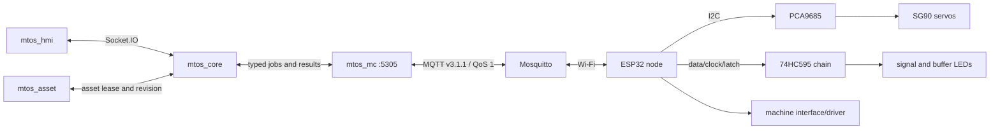

# mtos_mc scope and low-level design

Date: 2026-09-18. Status: design finalized; implementation not started.

`mtos_mc` is the loopback-only hardware abstraction for ESP32 accessory nodes.
It translates typed Core operations for turnouts, signals and trackside machines
into durable, node-specific MQTT jobs. It does not make route, interlocking,
lifecycle or autonomous-operation decisions.

## Boundary and responsibilities



Core remains the sole operational authority. It resolves Asset configuration,
obtains leases and fencing tokens, checks lifecycle eligibility and submits one
of three typed operations:

| Operation | Request value | Version 1 meaning |
|---|---|---|
| `turnout.set` | `straight | diverging` | Move one turnout; a double slip may contain two sequential servos |
| `signal.set` | `stop | slow | go` | Apply one valid aspect with break-before-make; asset type restricts values |
| `machine.execute` | configured action name | Run one bounded, asset-specific sequence, initially water-tank `operate` |

MC accepts no asset edit, route request, raw MQTT topic, GPIO number, PCA9685
channel, pulse width, shift-register bit or arbitrary timed pulse. HMI and AI
never contact MC or Mosquitto directly. MC never opens the EX-CSB1 serial port.

MC owns:

- one MQTT client connection and its reconnect policy;
- node availability, boot identity, producer session and installed revision;
- the durable execution/deduplication ledger and bounded event evidence;
- routing a logical asset operation to its owning node;
- the global servo scheduler and per-node dispatch ordering;
- command expiry, correlation, timeout and reconciliation state;
- projection of accepted, started, completed, failed and uncertain results to Core.

ESP32 firmware owns the installed asset-to-channel mapping, calibrated servo
endpoints, signal output image and bounded machine sequence. SQLite in Asset is
the configuration authority; node configuration is an explicitly installed,
versioned projection.

## Process, persistence and limits

The service listens on `127.0.0.1:5305` and requires the internal MTOS token.
Its database is `data/db/mc.sqlite3`, separate from Asset and Core databases.
It stores only adapter-owned state:

- `mc_metadata`: schema and monotonically increasing MC session epoch;
- `mc_execution`: immutable IDs/payload hash, Core session/epoch, asset lease,
  fence, node/boot/session, operation, state, timestamps and final result;
- `mc_event`: bounded structured node and transport evidence;
- `mc_node`: last boot, availability, installed revision, firmware and freshness;
- `mc_asset_fence`: highest accepted fence per asset.

Version 1 permits at most 256 non-terminal/outstanding executions, 20 MQTT QoS 1
inflight publications and 10,000 terminal execution records or seven days,
whichever bound is reached first. Pending, uncertain and reconciliation-required
records are never pruned to satisfy those limits. MQTT transcripts and secrets
are not stored in the database.

### Implementation layout and primary methods

```text
src/mtos/mc/
  models.py       immutable requests, execution/node/resource states
  protocol.py     MQTT envelope validation and canonical payload hashing
  repository.py   mc.sqlite3 migrations, ledger, events, fences and recovery
  mqtt.py         transport protocol, Paho adapter and deterministic fake
  nodes.py        availability, boot/session/configuration readiness
  scheduler.py    durable selection and global/per-node resource gates
  service.py      fenced Core-facing application service
src/mtos/mc_app.py
tools/mtos_mc
tests/test_mc_repository.py
tests/test_mc_protocol.py
tests/test_mc_scheduler.py
tests/test_mc_service.py
```

The principal internal interfaces are deliberately small:

```python
class McService:
    def establish_core_session(self, session_id: str, epoch: int) -> McState: ...
    def heartbeat(self, session_id: str, epoch: int) -> McState: ...
    def submit(self, request: ExecutionRequest) -> Execution: ...
    def execution(self, execution_id: str) -> Execution: ...
    def cancel(self, execution_id: str) -> Execution: ...
    def reconcile(self, execution_id: str, resolution: Resolution) -> Execution: ...
    def state(self) -> McState: ...
    def nodes(self) -> tuple[NodeState, ...]: ...

class McScheduler:
    def run_once(self) -> bool: ...
    def handle_event(self, event: NodeEvent) -> Execution: ...
    def recover(self) -> None: ...

class MqttTransport:
    def connect(self) -> None: ...
    def publish(self, topic: str, payload: bytes, qos: int, retain: bool) -> int: ...
    def disconnect(self) -> None: ...
```

The production scheduler has exactly one owning thread. HTTP handlers and MQTT
callbacks validate and enqueue work or events; they never execute a physical
sequence themselves. Tests call `run_once()` with fake time and transport for
deterministic scheduling.

## Core-facing interface

All requests below are internal JSON calls from Core:

| Method and path | Purpose |
|---|---|
| `GET /health` | Process liveness; never implies nodes are usable |
| `GET /ready` | Core session valid, broker connected and scheduler running |
| `GET /v1/state` | MC generation, broker state, servo gate and aggregate health |
| `GET /v1/nodes` | Node availability/readiness projection |
| `POST /v1/sessions` | Establish a higher fenced Core session |
| `POST /v1/heartbeat` | Maintain the two-second Core heartbeat |
| `POST /v1/executions` | Durably accept one typed execution |
| `GET /v1/executions/{execution_id}` | Return durable state and evidence |
| `POST /v1/executions/{execution_id}/cancel` | Cancel only before dispatch; otherwise reconcile |
| `POST /v1/executions/{execution_id}/reconcile` | Record explicit recovery evidence/resolution |

An execution submission contains `command_id`, `execution_id`, payload hash,
Core session ID and epoch, asset ID/revision, configuration revision, lease ID,
asset fencing token, node ID, operation, value/action and expiry. MC inserts it
durably before acknowledging acceptance. Identical retries return the stored
execution. Reuse of either immutable ID with another payload is rejected.

MC rejects an old Core epoch/session, expired lease/command, lower asset fence,
unsupported operation/value, unready node, boot/revision mismatch, duplicate
physical mapping evidence, queue overflow or conflicting execution. Acceptance
means durable admission only; it does not mean MQTT delivery or physical effect.

## Node identity and readiness

A node is ready only when all of these are true:

1. retained availability and a fresh status/heartbeat say it is online;
2. node ID and unique MQTT client identity match its credentials;
3. a new random `boot_id` identifies the current firmware boot;
4. firmware version is compatible;
5. installed configuration revision matches the requested asset mapping;
6. MC and the node have established the current `producer_session_id`;
7. no unresolved execution from this or an earlier boot blocks the node.

Availability alone never means ready. The default heartbeat interval is five
seconds; status becomes stale after 15 seconds and offline on the Last Will or
connection evidence. These values are configurable but fixed per deployment and
tested with a controllable clock.

On startup or reconnect MC publishes no retained operation and replays no old
physical command. It establishes a fresh producer session, queries/reconciles
non-terminal evidence, and only then accepts new dispatch for that node.

## MQTT contract

Mosquitto runs locally. Nodes connect over the trusted layout Wi-Fi with unique
credentials and topic ACLs. MQTT 3.1.1 compatibility, QoS 1 and these topics are
the Version 1 baseline:

```text
mtos/v1/nodes/{node_id}/commands       MC publishes; QoS 1; never retained
mtos/v1/nodes/{node_id}/events         node publishes; QoS 1; never retained
mtos/v1/nodes/{node_id}/availability   node online/LWT; QoS 1; retained
mtos/v1/nodes/{node_id}/status         boot/config/health heartbeat; QoS 1; retained
```

Shared subscriptions are forbidden because nodes are tied to physical wiring.
Offline broker queuing of command messages is disabled. A command targets the
current node, `boot_id`, producer session and installed revision. QoS PUBACK is
transport receipt only.

Example logical command:

```json
{
  "schema": "mtos.mc-command.v1",
  "command_id": "019c...",
  "execution_id": "019d...",
  "payload_hash": "sha256:...",
  "core_session_id": "core-session",
  "core_epoch": 7,
  "producer_session_id": "mc-session",
  "asset_id": "T012",
  "asset_fence": 31,
  "asset_revision": 4,
  "configuration_revision": 12,
  "node_id": "N001",
  "boot_id": "a4d31f76",
  "operation": "turnout.set",
  "value": "diverging",
  "issued_at": "2026-09-18T12:30:00Z",
  "expires_at": "2026-09-18T12:30:10Z"
}
```

Node events use the same IDs, sessions and revisions. State progresses only:

```text
queued -> dispatched -> accepted -> started -> completed
                                      |          |
                                      +-> failed +-> uncertain
          |              |
          +-> expired     +-> rejected
```

`cancelled` is possible only before dispatch. Delayed events cannot regress a
terminal state. A duplicate with the same ID/hash returns cached state/result
without repeating output; a duplicate ID with another hash is rejected. The node
retains deduplication evidence for the full expiry/retry interval, not merely a
fixed number of recent messages.

## Servo serialization

There is exactly one global servo permit across every ESP32 node and every
PCA9685. No second SG90 may begin while that permit is held. MQTT delivery to
different nodes is not used as concurrency control.

1. MC durably selects the oldest eligible servo execution.
2. MC acquires the single global permit before publishing it.
3. The node accepts only if its own actuator runner is idle.
4. An ordinary turnout moves its one SG90, settles and disables PCA9685 PWM.
5. A double slip moves its two calibrated SG90 components sequentially under
   the same permit. Partial completion is `uncertain`; there is no automatic rollback.
6. MC releases the permit only on a known terminal outcome that proves the node
   output sequence ended.

If contact is lost after dispatch, MC marks the execution `uncertain` and blocks
the global servo permit. It does not assume that a timeout stopped the physical
output and does not start another servo. Release requires matching node evidence
after reconnect or explicit supervised reconciliation. The ESP32 also enforces a
local monotonic movement watchdog and safe output-disable/reset wiring, but that
local protection does not authorize MC to guess the result.

Signal jobs never consume the servo permit. A machine job consumes it whenever
its installed sequence declares a servo component; therefore a future servo-based
machine cannot bypass global serialization. Non-servo machine jobs use a separate
`machine` resource and per-node output ordering.

## Output behavior

### Turnout

- Valid public states are only `straight` and `diverging`.
- The node resolves one or two component refs to local PCA9685 channels.
- It sweeps to calibrated endpoints, settles, then sets full-off PWM.
- `completed` means the configured timed sequence ended; without sensors it is
  not proof that the points physically reached the target.

### Signal

- Ground/branch two-aspect signals accept `stop | go`; mainline three-aspect
  signals accept `stop | slow | go`.
- One firmware output-image owner preserves unrelated 74HC595 bits.
- A transition clears this signal's aspect bits, latches, waits the configured
  break-before-make interval, then enables exactly one aspect and latches again.
- Boot/reset keeps output enable inactive until a complete safe image is loaded.
  After valid configuration, commanded signals initialize to `stop`, never a
  previously remembered permissive aspect. Failure reports `dark` or `uncertain`;
  `dark` is electrical state, not a railroad aspect.

Signal commands are serialized per node so two writers cannot corrupt the shared
shift-register image. Different ready nodes may change signals concurrently.

### Trackside machine

- Core submits only an action declared by that asset's installed configuration.
- Firmware translates the action into one bounded sequence with maximum duration,
  cleanup and declared resources; HMI cannot supply arbitrary pulse timing.
- Initial scope is the Broadway Limited Imports 7924 HO Operating Water Tower
  with Sound, UP, Weathered. The manufacturer specifies standard 12 V DC power,
  a supplied pushbutton to trigger its internal motor-and-sound sequence, and an
  optional accessory decoder. MTOS deliberately omits the DCC/accessory decoder.
- The tower receives native 12 V from its own fused branch tapped before the
  node's XL4015. The converter continues to supply only the node's 5 V loads.
- `operate` makes the ESP32 generate one bounded, non-blocking contact pulse. A
  normally-open isolated relay contact is wired in parallel with the supplied
  pushbutton, so either MTOS or the retained physical button can trigger the same
  factory input. The relay does not switch or synthesize DCC.
- ESP32 GPIO drives the relay coil through a suitable transistor/MOSFET stage;
  an electromagnetic coil requires its flyback diode. A module must accept 3.3 V
  logic without back-feeding the ESP32. Relay contacts remain electrically
  separate from node logic and are rated from measured trigger voltage/current.
- The relay defaults open through boot/reset and opens again after `contact_ms`.
  Firmware then holds the machine busy for the measured factory sequence window,
  rejects retriggering, and reports completion with `physical_feedback=false`.
  This proves only that the contact pulse and configured wait completed, not that
  the spout moved or sound played.
- Do not connect a GPIO, PCA9685 output or 74HC595 output directly to the supplied
  switch leads. Before wiring the relay, measure open-switch voltage, closed-
  switch current, contact polarity sensitivity, required press duration, complete
  cycle time and 12 V operating/peak current. Preserve the original button.
- Turntable positioning/homing, chemical-plant lighting and arbitrary user-defined
  sequences remain outside Version 1 until their hardware/action models exist.

The word “pulse” in the MC contract therefore means a timed relay-contact closure,
not a voltage pulse injected into the water tower. The exact `contact_ms` and
busy timeout are commissioned configuration, not remotely supplied command values.

Manufacturer reference: [BLI 7924 Operating Water Tower](https://broadway-limited.com/products/7924-operating-water-tower-w-sound-up-weathered-ho).

PECO SL-40 buffer LEDs are node-local indicators, not signal aspects or HMI jobs.
After valid node configuration they flash red at 500 ms on/500 ms off using a
non-blocking ESP32 timer and 74HC595 output image. They continue during broker or
SBC loss while the node remains healthy. No MQTT command is sent per flash and no
555 circuit is required by the baseline design.

## Scheduler and failure rules

MC uses one durable selection loop, not one unbounded thread per job. FIFO order
applies among eligible jobs of the same resource, while Core safety commands may
invalidate or cancel work that has not been dispatched.

- Servo: concurrency one globally and blocked by uncertainty.
- Signal: concurrency one per node; no servo permit.
- Machine: concurrency one globally in Version 1; also acquires the servo permit
  if its installed resource declaration contains a servo.
- One asset may have only one non-terminal execution.
- Node firmware runs only one actuator/machine sequence at a time; its signal
  output manager may operate concurrently through non-blocking state handling.

Core heartbeats MC every two seconds. After six seconds without a valid heartbeat,
MC accepts no new work and dispatches no queued work. A node already executing may
finish its bounded sequence; MC records late matching evidence for reconciliation.
MC restart reconstructs the ledger, establishes a higher session and reconciles
non-terminal jobs without blindly publishing them again.

Timeouts are derived from the installed sequence, not a universal three-second
constant. Publish/accept retry uses the same immutable IDs once; after a possible
dispatch, loss of evidence becomes `uncertain`. Absolute expiry is enforced only
when node time validity and allowed skew are established; movement watchdogs use
local monotonic time.

## HMI projection

Core adds MC state to the existing HMI snapshot. HMI will show:

- broker and MC readiness;
- each node as `unknown | online | stale | offline | error` plus installed revision;
- asset desired, reported and observed state as separate values;
- job progress `queued | dispatched | accepted | started | completed` and explicit
  `rejected | failed | expired | cancelled | uncertain` outcomes;
- disabled controls with the exact eligibility/readiness reason.

The HMI tabs cover Turnout, Signal and Machine but submit commands only to Core.
Completion without a feedback sensor is labelled output-sequence completion, not
confirmed physical position or illumination.

## Implementation and verification sequence

1. Add MC protocol types, owned SQLite schema/repository and fake clock/MQTT.
2. Implement fenced Core session, heartbeat, execution idempotency and recovery.
3. Implement node registry, producer-session handshake and configuration checks.
4. Implement the global servo permit with one ordinary turnout fake.
5. Add signal output behavior and HMI/Core projections.
6. Add double-slip sequential execution and uncertain partial-failure recovery.
7. Add water-tank `operate` using a relay across the factory pushbutton only after
   measuring its trigger circuit, full cycle timing and 12 V current.
8. Commission one physical node before enabling multiple nodes.

Automated tests cover duplicate/different payloads, old fences/sessions, stale
nodes, out-of-order events, restart recovery, servo exclusion across two nodes,
double-slip partial failure, signal changes during servo work, shared-register
bit preservation, machine resource declaration, queue limits and buffer flashing.
Hardware tests record firmware/config revisions, supply voltage/current, timing,
watchdog/reset behavior and observed output. No automated test contacts a live
broker or GPIO unless explicitly marked as a supervised integration test.

## Deliberately unresolved hardware facts

These do not change the service/API architecture but must be measured before the
related output is commissioned:

- water-tank switch voltage/current/polarity sensitivity, required contact time,
  complete cycle time, 12 V current and final relay/contact rating;
- constructed 74HC595 voltage/current and any transistor/MOSFET driver stage;
- exact servo sweep/settling/watchdog values and SG90 current for each mechanism;
- node credentials/TLS choice for the final isolated layout network;
- turntable mechanism, homing, position feedback and action vocabulary.
