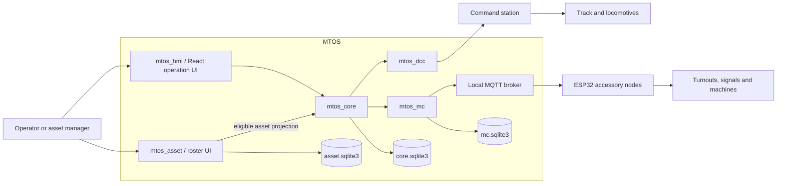

# System context and bounded contexts

## Asset management

Owns durable asset identity, lifecycle, configuration, maintenance,
relationships, and the rules that determine whether an asset may be offered for
operation. It owns `asset.sqlite3`; other services do not open it directly.

## Railroad operation

Owns live layout operation: control sessions, throttle state, power, occupancy,
routes, interlocking, signals, turnouts, and observed hardware state. Current
Version 1 implements low-level DCC MAIN and accessory-command coordination; route,
occupancy and interlocking remain later work. Core owns `core.sqlite3`, refers to
durable assets by `asset_id`, and does not redefine them.

## Command-station adapters

Translate protocol-independent operations into DCC-EX or other hardware
protocols. An adapter owns connection and protocol mechanics, not asset truth.

## Accessory-network adapter

Publishes accessory intent and consumes acknowledgements, reported state, and
node availability. MQTT is the first transport. Retained broker messages and
node-local variables are delivery aids, not MTOS's canonical operational store.
MC owns only bounded subordinate execution evidence in `mc.sqlite3`.

## Optional capabilities

Search, conversational interfaces, and local language models consume public
application operations. They are not authorities and must not bypass domain
validation.
