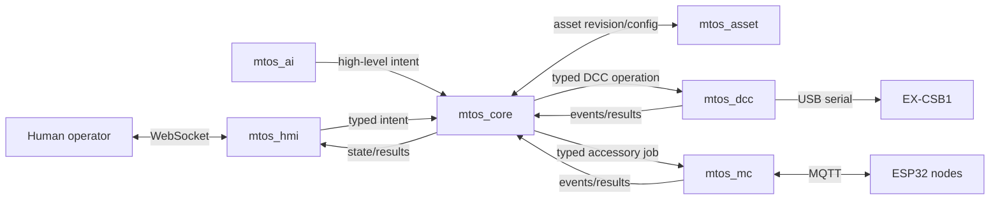

# ADR-009: Service decomposition and real-time control architecture

- **Status:** Accepted
- **Date:** 2026-09-18
- **Extends:** ADR-001 and ADR-007
- **Companion:** [Control-service architecture](../architecture/control-service-architecture.md)

## Context

MTOS began with two Flask services:

- `asset_manager` on port 5301;
- `asset_control` on port 5302.

The initial `asset_control` implementation combined the browser application,
asset eligibility, operational command handling, EX-CSB1 serial ownership and
future ESP32 responsibilities. Its first React interface used ordinary HTTP
commands and one-second polling. This was functionally small but produced delayed
or overwritten feedback compared with the working predecessor, which pushed
command-station state through Socket.IO.

The product scope now includes asset management, human operation, DCC locomotive
control, CV programming, ESP32-controlled stationary assets and later autonomous
operation. These responsibilities have different ownership, failure, security,
timing and deployment characteristics:

- inventory changes are transactional master-data operations;
- human interfaces are replaceable command producers;
- railroad safety and resource arbitration must be deterministic;
- one process must exclusively own the command-station serial port;
- ESP32 nodes communicate asynchronously over Wi-Fi/MQTT;
- an SLM can propose intent but must not control physical outputs directly.

Deployment may use Cubietruck, Raspberry Pi, Vicharak Axon or another supported
Linux host. Architecture is not collapsed around one board, but Cubietruck is not
considered too small without measurement. The normal non-AI stack has a planning
allowance of roughly 0.5–0.9 GiB including a headless OS; this is an estimate, not
a supported-hardware claim. Platform maintenance, CPU latency and peripheral
reliability may matter before RAM does.

## Decision

Implementation checkpoint (2026-09-18): the Phase 1 path comprising
`mtos_asset`, `mtos_dcc`, `mtos_core` and `mtos_hmi` is integrated. The
coordinator and operational sequence are documented in
[Integrated service startup and shutdown](../operations/service-startup.md).
This checkpoint does not implement `mtos_mc`, CV/PROG or autonomous operation.
The approved MC implementation contract is recorded separately in
[mtos_mc scope and low-level design](../architecture/mtos-mc-module.md).

### Named services

MTOS adopts six services with explicit ownership:

| Service | Responsibility |
|---|---|
| `mtos_asset` | Asset inventory, lifecycle, configuration, relations and media |
| `mtos_hmi` | React human-machine interface and browser real-time sessions |
| `mtos_core` | Central operational authority, arbitration, safety and orchestration |
| `mtos_dcc` | DCC command-station hardware abstraction, initially EX-CSB1 |
| `mtos_mc` | Microcontroller hardware abstraction for ESP32 stationary assets |
| `mtos_ai` | Optional SLM/autonomous intent producer |

`mtos_core` is the central nervous system of MTOS. It is the only service that
may authorize and coordinate an operational command. `mtos_dcc` and `mtos_mc`
are hardware-abstraction services, not independent operational authorities.

All services remain in one monorepo initially and share versioned domain/protocol
packages. They do not share unrestricted mutable runtime state.

### Default endpoints and exposure

| Service | Default endpoint | Exposure |
|---|---|---|
| `mtos_asset` | `0.0.0.0:5301` | trusted layout LAN |
| `mtos_hmi` | `0.0.0.0:5302` | trusted layout LAN |
| `mtos_core` | `127.0.0.1:5303` | local services only |
| `mtos_dcc` | `127.0.0.1:5304` | local Core only |
| `mtos_mc` | `127.0.0.1:5305` | local Core only |
| `mtos_ai` | `127.0.0.1:5306` when co-hosted | local intent producer |
| Mosquitto | `127.0.0.1:1883` plus a controlled node listener | authenticated ESP32 nodes |

Only Asset and HMI are normally accessible to browsers. Internal services do not
bind indiscriminately to the LAN. A remote AI host uses an authenticated,
allowlisted ingress or secure tunnel; it is not a reason to expose all Core APIs.

### Authority and command flow

Human, scheduled and AI functions are command producers. They submit intent to
Core. They never address a serial frame, MQTT topic, servo channel, shift-register
bit or physical output directly.

Core owns:

- asset/configuration revision validation;
- lifecycle and operational eligibility;
- command IDs, client sequences, sessions and idempotency;
- locomotive, asset, route and actuator reservations;
- arbitration between human, scheduled and autonomous producers;
- durable command journal and uncertain-operation recovery;
- future block occupancy, route locking and interlocking;
- dispatch of typed requests to hardware abstractions;
- system-wide generation changes and emergency coordination.

Suggested priority is physical power removal/system emergency, human emergency or
stop, deterministic safety/interlocking, accepted human operation, then accepted
autonomous/scheduled operation. Priority never permits an unsafe command.

### DCC hardware abstraction

`mtos_dcc` exclusively owns:

- command-station discovery and identity verification;
- the EX-CSB1 USB serial connection;
- DCC-EX framing, encoding and parsing;
- continuous serial reads and correlated command outcomes;
- MAIN power, throttle, functions and emergency stop;
- later PROG output and CV read/write workflows;
- observed connection, output, power and locomotive reports.

It accepts only typed operations from Core. It retains an independent emergency
write path, discards old-session work after disconnect and never automatically
restores power, speed, direction or functions.

### Microcontroller hardware abstraction

`mtos_mc` owns:

- the MQTT client and ESP32 node sessions;
- node heartbeat, boot identity, installed configuration and readiness;
- durable accessory jobs and global servo sequencing;
- turnout, signal, buffer indicator and machine execution;
- accepted, started, completed, failed and uncertain results;
- MQTT topic/payload projection and node-specific access control.

MQTT is only the `mtos_mc`–ESP32 boundary. Browsers, AI and Core do not publish
raw node topics. Commands use QoS 1 and idempotent versioned envelopes; broker
receipt is not physical completion.

### Human-machine interface and real-time protocol

`mtos_hmi` serves the compiled React/TypeScript interface. Browser command and
state communication uses Socket.IO over WebSocket with:

- initial full snapshot;
- control session ID and generation;
- monotonically increasing event sequence;
- command ID, client ID and client sequence;
- immediate accepted/rejected acknowledgement;
- separate sent, completed, failed and uncertain events;
- full resynchronization after reconnection, sequence gaps or session changes.

Normal operation does not depend on one-second polling. HTTP remains for static
assets, health/readiness, and bounded diagnostic or compatibility endpoints.
A WebSocket acknowledgement proves application acceptance only, not serial
transmission, device reporting or physical effect.

Waitress continues to be suitable for `mtos_asset`, but it is not the selected
runtime for WebSocket HMI delivery. The implementation will choose and test a
supported Socket.IO deployment, initially preferring Flask-SocketIO with a
single-worker threaded Gunicorn/simple-websocket configuration unless SBC testing
shows an ASGI python-socketio server is preferable.

### AI boundary

`mtos_ai` is optional and outside the safety-critical control path. It may:

- interpret natural-language instructions;
- propose routes and operating plans;
- submit high-level intents;
- explain decisions and request operator clarification.

It may not:

- issue raw DCC-EX or MQTT commands;
- select physical channels or servo positions;
- set signal outputs without deterministic route/interlocking validation;
- bypass reservations, occupancy, generation or safety checks;
- prevent manual operation when unavailable.

An instruction such as “clear yard_south_4 to main_south_2 for UP 28” is resolved
and proven by deterministic Core logic. SLM output is untrusted intent, not
evidence of a safe route.

### Data ownership

Services do not gain unrestricted write access to one shared database merely
because they run on the same host.

- `mtos_asset` owns asset master data and its persistence.
- `mtos_core` owns operational commands, reservations, routes, sessions and
  uncertain outcomes.
- `mtos_dcc` and `mtos_mc` own transient adapter state and only the bounded
  adapter persistence explicitly required by their contracts.
- `mtos_hmi` and `mtos_ai` own no authoritative railroad state.

The initial implementation may migrate from the existing SQLite file in stages,
but cross-service access must go through owned repositories/APIs and converge on
separate ownership. No database transaction is claimed to be atomic with physical
hardware. Address programming and similar workflows use durable orchestration
rather than distributed transactions.

### Cross-service asset lease and fencing protocol

A revision read followed by dispatch is insufficient because Asset could change
configuration between those operations. Core therefore obtains a durable,
Asset-owned lease before dispatching work that depends on mutable configuration.

The internal Asset API atomically accepts sorted asset IDs, expected asset and
configuration revisions, Core instance/control-session IDs, purpose, workflow ID
and requested duration. One Asset transaction verifies every revision/conflict,
increments a monotonic fencing token per affected asset and records every lease.
Either all requested assets are leased or none are.

Core includes asset ID, revision, lease ID and fencing token in every DCC/MC
dispatch. Adapters reject absent, expired or lower tokens than the highest already
observed for that asset. Core renews leases every 10 seconds; the normal lease
expires after 30 seconds without renewal. Expiry does not immediately authorize
a conflicting control edit: Asset changes it to
`expired_pending_reconciliation`. Protected edits remain blocked until physical
state is reconciled and the lease is explicitly cleared. Descriptive fields and
media remain editable. Leases and fencing counters survive restart.

Asset blocks changes to DCC address, lifecycle eligibility, node membership,
component/channel mapping, calibration, required dependencies and other protected
configuration under a held or unreconciled lease. Address programming holds the
same lease through hardware verification and conditional Asset update; no
distributed transaction is claimed.

### Core session, failure and emergency contract

Core establishes a fenced session with DCC and MC and heartbeats every two
seconds. An adapter considers Core stale after six seconds without a valid
heartbeat. A new Core session has a new ID and higher fencing epoch; adapters
reject late commands from older sessions.

When Core becomes stale, DCC:

1. rejects ordinary commands and removes queued unsent motion;
2. marks transmitted/in-flight work uncertain;
3. sends one DCC-EX emergency speed stop (`<!>`) if serial remains ready;
4. records known desired locomotive speeds as zero;
5. leaves track power unchanged rather than claiming power removal;
6. requires a new fenced handshake and reconciliation before movement.

MC stops dispatching queued jobs. A node already executing an accepted action may
finish its bounded local sequence; MC records the result for reconciliation. It
does not start another servo job. Signals and local buffer flashing follow their
configured node-loss policy.

HMI has one authenticated, narrowly scoped emergency-only bypass to DCC when Core
is unavailable. It may request all-stop but cannot throttle, change functions,
energize power or program CVs. Accessible physical power-off remains mandatory
because software cannot stop hardware over a failed host or serial link.

### Core and MC durable-job recovery

Core owns the canonical operational command and system-visible result. MC owns an
execution ledger sufficient for physical deduplication and recovery. Both use the
same immutable `command_id`, `execution_id`, payload hash, Core session, asset
fencing token and configuration revision.

MC durably inserts execution before acknowledging acceptance. A duplicate with
the same IDs and payload returns stored state/result; reuse with another payload
is rejected. After reconnect/restart, Core queries MC for every non-terminal
command. MC returns its durable state and node evidence. Core never blindly
republishes a physical action whose acknowledgement was lost.

Delayed node events may advance a matching non-terminal execution but cannot
regress terminal state. Unknown execution after dispatch becomes `uncertain`
and blocks conflicting work pending reconciliation. Core owns operational
outcome; MC owns evidence of whether and how hardware execution was attempted.

### Bounded-resource defaults

| Resource | Version 1 limit and overflow behavior |
|---|---|
| HMI simultaneous browser sessions | 8; additional sessions receive unavailable |
| HMI unacknowledged commands per client | 32; reject further normal commands |
| HMI outbound backlog per client | 256 events or 1 MiB; require resynchronization |
| WebSocket body | 16 KiB command; 64 KiB event |
| Core normal ingress queue | 256; reject busy; separate emergency slot |
| DCC normal queue | 64 with throttle coalescing; stop/emergency bypass |
| DCC parsed-event ring | 256 |
| MC outstanding jobs | 256; one active servo movement globally |
| MQTT QoS 1 inflight | 20 per client; no unbounded offline command queue |
| Socket replay | most recent 1,024 events and no more than 5 minutes |
| Core terminal command history | 7 days and at most 10,000 terminal records |
| MC terminal execution history | 7 days and at most 10,000 terminal records |

Pending, uncertain and reconciliation-required records are never pruned merely
to meet count/age limits. Cleanup removes oldest terminal records in bounded
batches. Slow clients resynchronize from a current snapshot.

### Deployment and supervision

Each service is an independently supervised process with:

- a systemd unit;
- health and readiness endpoints;
- structured logs and service identity;
- explicit dependency/startup behavior;
- bounded retries and no automatic physical-command replay;
- versioned API/event contracts;
- graceful shutdown and exclusive hardware/resource ownership.

Containers and Kubernetes are not required. Process separation is for ownership
and fault isolation, not distributed-system fashion.

### Deployment resource envelope and validation

The six names describe ownership boundaries; they do not imply six heavyweight
framework stacks. The non-AI deployment has this initial steady-state planning
budget, to be replaced by measurements on the selected host:

| Process | Planning RSS |
|---|---:|
| `mtos_asset` | 50–100 MiB |
| `mtos_hmi` | 60–120 MiB |
| `mtos_core` | 50–100 MiB |
| `mtos_dcc` | 30–60 MiB |
| `mtos_mc` | 35–70 MiB |
| Mosquitto | 5–20 MiB |
| Headless OS and system services | 180–300 MiB |

This makes a 2 GiB host plausible for the non-AI stack, but not certified.
`mtos_ai` has a separate hardware and memory budget. A new general-purpose host
should normally have at least 4 GiB; 8 GiB is useful headroom, not an application
requirement established by this ADR.

Before declaring a platform supported, run a soak test with the representative
roster, four accessory nodes, 20 turnouts, 20 signals, one to four browser
sessions and concurrent locomotive traffic using fake hardware first and real
hardware under supervision. Record process PSS/RSS, system `MemAvailable`, swap,
command/event latency, reconnect behavior and emergency-stop latency. Repeat while
an image is uploaded, but do not run bulk media import during railroad operation.

## Consequences

### Positive

- CSB1 state and command progress reach the browser immediately.
- Human and autonomous operation share one deterministic safety boundary.
- Device protocols do not leak into UI, asset or AI code.
- DCC and microcontroller adapters can fail or restart independently.
- Asset management remains available during hardware-control failures.
- New command stations or microcontrollers can implement stable adapter contracts.
- Service-level testing, logging and supervised recovery become clearer.
- Remote AI is optional and cannot become a hidden hardware dependency.

### Negative

- More processes require startup ordering, health checks and systemd units.
- Versioned inter-service contracts and compatibility testing are mandatory.
- Real-time reconnection, duplicates, sequence gaps and stale sessions increase
  test scope.
- Data ownership must be migrated from the current shared-SQLite assumptions.
- WebSocket HMI deployment replaces the simpler Waitress-only arrangement.
- Cross-service workflows such as address programming require durable orchestration
  and recovery rather than one in-process call stack.

### Neutral constraints

- WebSocket improves application responsiveness but cannot prove physical motion.
- MQTT delivery and PUBACK do not prove accessory completion.
- A disconnected browser does not imply locomotive stop.
- Core failure prevents new normal commands, but hardware-specific emergency and
  physical power-off mechanisms remain necessary.

## Alternatives considered

### Keep `asset_manager` and one large `asset_control`

Rejected as the target architecture. It is simpler initially but combines UI,
operational policy, serial ownership and MQTT scheduling, making later autonomy,
failure isolation and independent device evolution harder.

### Five logical modules in one process

Rejected after removal of the obsolete A20 constraint. Modular code remains
necessary, but independent supervised processes now provide useful ownership and
fault isolation.

### Allow HMI or AI to call hardware services directly

Rejected. It would duplicate safety policy and allow producers to bypass Core
reservations and interlocking.

### Use MQTT for all internal communication

Rejected. MQTT remains appropriate for intermittent ESP32 nodes, but it should
not become the universal synchronous operational RPC mechanism or expose retained
hardware commands to unrelated services.

### Use browser HTTP polling

Rejected as the primary operational path. It caused visible latency and competing
requests. HTTP remains a diagnostic and compatibility mechanism.

## Implementation sequence

1. Freeze shared versioned command, event, error and health schemas.
2. Extract `mtos_asset` from the current asset-manager executable without
   changing its user-visible capability.
3. Extract the tested serial owner into `mtos_dcc`.
4. Implement `mtos_core` command arbitration, reservations and DCC client.
5. Move the React application into `mtos_hmi` and replace polling/HTTP commands
   with acknowledged Socket.IO snapshots and events.
6. Add systemd supervision, loopback binding and integration tests.
7. Commission CSB1 MAIN under explicit operator supervision.
8. Implement `mtos_mc`, Mosquitto integration and the first complete ESP32 node.
9. Add PROG/CV workflows through Core and DCC with durable address-change recovery.
10. Add `mtos_ai` only after occupancy, route reservation and interlocking
    contracts are implemented and tested.

This ADR decides boundaries and authority. Exact inter-service RPC technology,
authentication implementation and database migration steps remain detailed
design decisions, but must conform to these boundaries. The bounded-resource
defaults above are the Version 1 baseline and may change only through measured,
documented revision.
